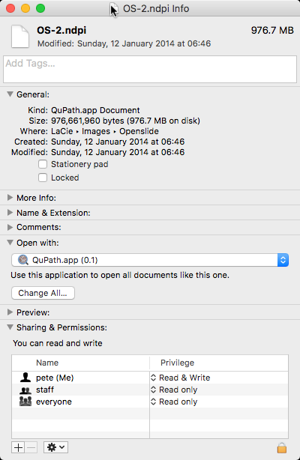

QuPath extension macOS
======================

This extension helps encourage QuPath to behave more like a native application when running on a Mac.

Specifically, it helps with file associations so that files can be automatically opened up within QuPath by double-clicking on them from within Finder.

*However*, a known limitation is that this only works whenever QuPath is already running.  Unfortunately, double-clicking a file when QuPath is not yet running will not cause it to open immediately... rather, QuPath will start up and then the file needs to be double-clicked again to open it.

> This extension is **only** useful when QuPath is running on a Mac.  It does not help for Windows or Linux.

## Installation

Installing the extension should be straightforward:

* Download the latest release of the extension qupath-extension-osx-0.0.1.jar
* Start up QuPath
* Drag the extension onto the main QuPath window
* Select an extensions directory (or accept the default) if prompted to do so

## Associating files

This extension can be used to help associate whole slide images with QuPath, not simply QuPath's own files (e.g. *.qpdata* and *.qpproj*).

To do so:

* Select one example of a file you want to associate with QuPath in Finder
* Select *File &rarr; Get Info* in *Finder* (or press Cmd + I)
* Under *Open with:* select *QuPath.app* - this will probably involve navigating to wherever QuPath is stored (and enabling 'All applications' for selection, rather than only 'Recommended applications')
* Press the *Change all...* button so that all files with the same extension will become associated with QuPath

